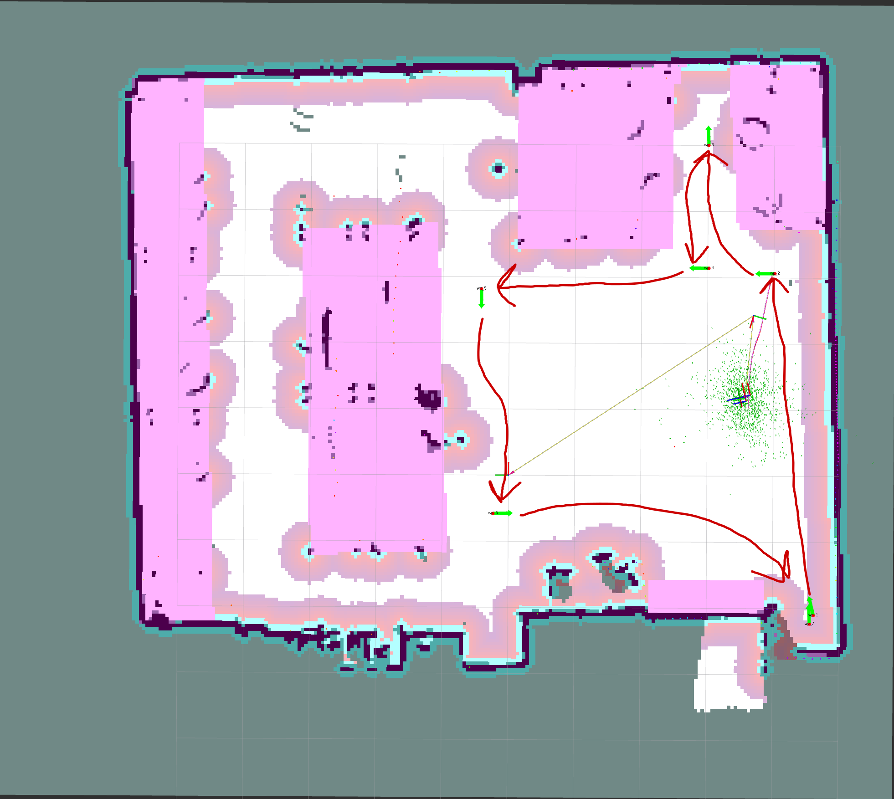

# Project 9: Path Planning and Following
Reid Beckes, Jackson Newell, Ian Mattson, and Anders Smitterberg


# Introduction + Setup

-

This project is completed and tested in ROS2 Jazzy Jalisco on an Ubuntu 24.04 Noble Numbat PC.

Each Turtlebot3 in EERC 722 is assigned a static IP on a lab managed wireless router. Our group used Turtlebot Anchovy, which is assigned local IP address 32.80.100.108 and `ROS_DOMAIN_ID=8`.

The testing environment is setup on a local PC by exporting the following parameter flags:
```bash
$ export ROS_DOMAIN_ID=8
$ export TURTLEBOT3_MODEL=burger
$ export RMW_IMPLEMENTATION=rmw_fastrtps_cpp
```

The Turtlebot3 modified Nav2 parameters are located here: [`/config/nav2_params.yaml`](./config/nav2_params.yaml). Further instructions on launching the Turtlebot3 Nav2 node are in the Usage Instructions section.

# Part 1 - Route Design

## Route Justification

The route begins in a corner of EERC 722 and moves toward the lab tables, which are designated as keepout zones, satisfying the requirement to pass within 0.5 m of a keepout zone boundary so that inflation and keepout costs actively influence the planned path. The robot then navigates into a tight space near the tables and must turn around, or reverse to escape, producing heading changes well in excess of 45 degrees and making controller behavior during turns (hopefully) clearly visible. After exiting the tight area, the route loops through the open section of the lab, skirting additional keepout zone boundaries before returning to the start. The full loop covers well over 4 meters of travel, and the repeated proximity to keepout zones throughout the loop hopefully gaurantees that the costmap's inflation plays a meaningful role in both planner and controller decisions at multiple points along the path.

## Route Map



## Start and Goal Poses

The route is a loop — the robot visits all 6 waypoints in order and returns to waypoint 0. Waypoints are stored in [`config/waypoints.yaml`](./config/waypoints.yaml).

| Waypoint | x (m) | y (m) | yaw (rad) |
| :------: | :----: | :----: | :-------: |
| 0 (start/end) | 3.066 | -4.016 | 1.579 |
| 1 | 5.003 | -3.008 | 0.030 |
| 2 | 3.143 | -3.017 | 1.561 |
| 3 | 2.816 | 0.419 | 3.137 |
| 4 | -0.580 | 0.230 | -1.548 |
| 5 | -2.230 | -4.560 | 0.038 |


# Part 2 - Planner and Controller Comparison

## 2a. Planner Comparison (Dijkstra vs. A\*)

-

## 2b. Controller Comparison (RPP vs. DWB)

-

## 2c. Run Results Summary

| Run | Planner | Controller | Observations |
|-----|---------|------------|--------------|
| 1 | Dijkstra | RPP |  |
| 2 | A\* | RPP |  |
| 3 | A\* | DWB |  |


# Part 3 - Analysis

## Planner Comparison Analysis

**Did Dijkstra and A\* produce identical or different paths?**

-

**Is the straight-line heuristic informative or misleading near the keepout zone boundary?**

-

## Controller Comparison Analysis

**Describe one moment where RPP and DWB produced observably different behavior.**

-

**Was `lookahead_dist: 0.4 m` a good choice for your route?**

-


# Usage Instructions

### Setup a ROS workspace and clone the package

First, setup a new workspace and clone the package:
```bash
$ mkdir -p proj9_ws/src
$ cd proj9_ws/src
$ git clone git@github.com:Robust-Autonomous-Systems-Laboratory/project9-group1.git
```
Then, build and source the package:
```bash
$ cd ~/proj9_ws
$ colcon build
```

All commands are run from the workspace root (`proj9_ws/`). Source the workspace and set the robot model before running anything for all workstation terminals:

```bash
$ export TURTLEBOT3_MODEL=burger
$ export ROS_DOMAIN_ID=8
$ source install/setup.bash
```

### Terminal 1 — TurtleBot3 bringup (SSH into robot, run on the robot)
```bash
$ ros2 launch turtlebot3_bringup robot.launch.py
```

### Terminal 2 — Costmap filter servers (workstation)
```bash
$ ros2 launch src/project9-group1/config/filters_launch.py
```
Wait until you see `Managed nodes are active` before proceeding.

### Terminal 3 — Nav2 with both planners and controllers (workstation)
```bash
$ ros2 launch turtlebot3_navigation2 navigation2.launch.py \
  use_sim_time:=False \
  map:=src/project9-group1/maps/map_eerc722.yaml \
  params_file:=src/project9-group1/config/nav2_params.yaml
```

Once Nav2 is up, use RViz2's **2D Pose Estimate** to initialize AMCL before sending any navigation goals.

### Terminal 4 — Run all planner × controller combinations
```bash
$ ros2 launch planner_controller_testing run_combinations.launch.xml
```

### Selecting a specific planner and controller combination at runtime

- __NEED TO MODIFY SCRIPT FOR THIS? ASSIGNMENT WANTS AUTO EXECUTION OF EACH PERMUTATION, NOT USER SELECTION.  READDRESS THIS SECTION LATER @IQM !!__


# AI Disclosure

**Anders Smitterberg**

-

**Reid Beckes**

-

**Jackson Newell**

-

**Ian Mattson**

- Google Gemini was used to help generate the syntax to configure a ROS node to access the a parameter file in the repo's `/config` directory outside the ROS 2 package, using the prompt:

  " How to setup a ros2 python node to access parameters in a given directory outside the ros2 package "

  The output was tuned to include our group's specific package name, [`waypoints.yaml`](./config/waypoints.yaml) and needed to be modified such that it accessed the file outside of the ROS package that used it, per the assignment directory structure.  This was tested and verified to work with minimal modification by testing the node and checking waypoints were properly loaded.
