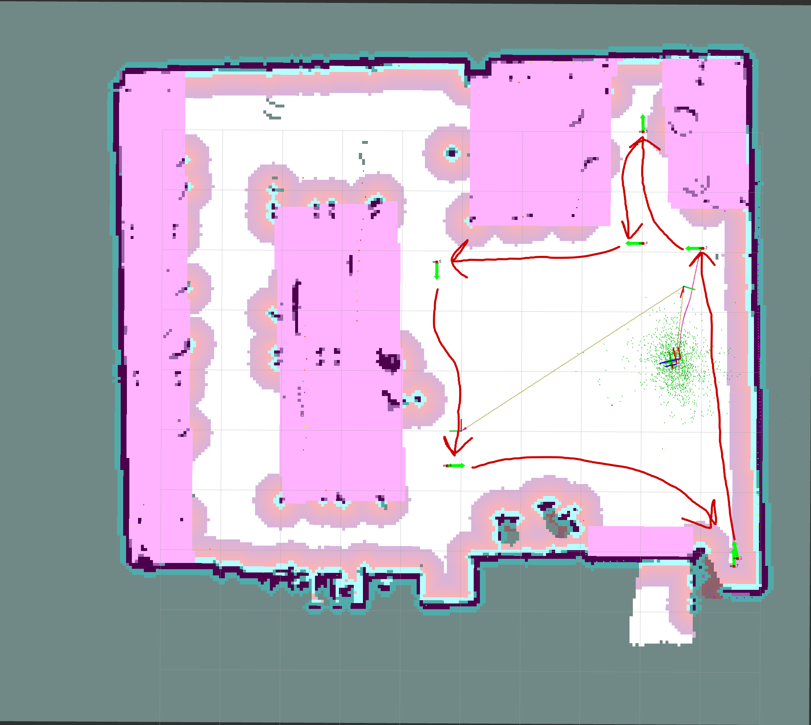
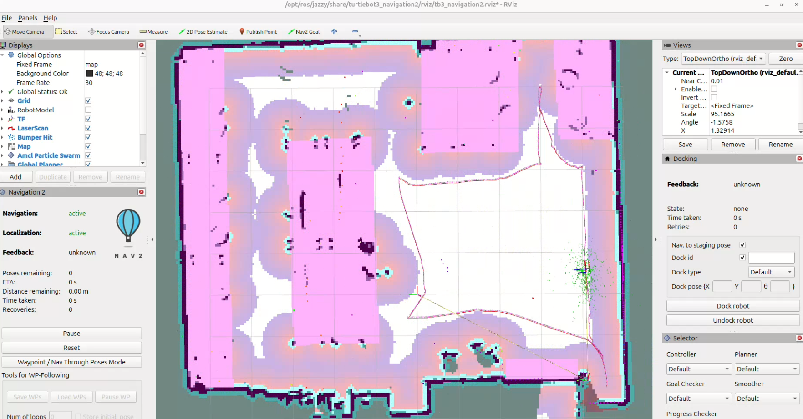
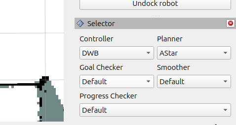

# Project 9: Path Planning and Following
Reid Beckes, Ian Mattson, Jackson Newell, and Anders Smitterberg


# Introduction + Setup

This project compares the Dijkstra and A* path planners in the Nav2 package, as well as the Regulated Pure Pursuit (RPP) and Dynamic Window controllers.

This project is completed and tested in ROS2 Jazzy Jalisco on an Ubuntu 24.04 Noble Numbat PC.

Each Turtlebot3 in EERC 722 is assigned a static IP on a lab-managed wireless router. Our group used Turtlebot Tomato, which is assigned a local IP address 32.80.100.107 and `ROS_DOMAIN_ID=7`.

The testing environment is set up on a local PC by exporting the following parameter flags:
```bash
$ export ROS_DOMAIN_ID=7
$ export TURTLEBOT3_MODEL=burger
$ export RMW_IMPLEMENTATION=rmw_fastrtps_cpp
```

The Turtlebot3 modified Nav2 parameters are located here: [`/config/nav2_params.yaml`](./config/nav2_params.yaml). Further instructions on launching the Turtlebot3 Nav2 node are in the Usage Instructions section.

## Issues Encountered + Solutions
During development of this assignment, we learned that in order to control which path planner and controller Nav2 uses, we cannot use the common Nav2 Commander API commands such as `goToPose()`, `goThroughPoses()`, `followWaypoints()`.  

To allow our script in Part 2 to execute all three combinations programmatically, one after another, we leveraged the `getPathThroughPoses()` to plan a path with the specific controller, then fed the resulting path into the `followPath()` command, specifying the specific controller.

Furthermore, the Nav2 commander exhibited interesting behavior when cycling to the next planner and controller combination.  Specifically, when the goal waypoint was met, the next cycle would trigger with a different planner and controller.  However, since the robot was already at the goal pose, Nav2 would indicate that as a successful completion and terminate prematurely.  This was resolved by using the Nav2 `spin()` and `driveOnHeading()` functions to rotate the robot 180 degrees, facing the room, then driving forward 25 cm before replanning.  This distance placed the robot outside of the goal acceptance region and allowed the robot to proceed on the next planned path around the lab.

# Part 1 - Route Design

## Route Justification

The route begins in a corner of EERC 722 and moves toward the lab tables, which are designated as keepout zones, satisfying the requirement to pass within 0.5 m of a keepout zone boundary so that inflation and keepout costs actively influence the planned path. The robot then navigates into a tight space near the tables and must turn around, or reverse to escape, producing heading changes well in excess of 45 degrees and making controller behavior during turns (hopefully) clearly visible. After exiting the tight area, the route loops through the open section of the lab, skirting additional keepout zone boundaries before returning to the start. The full loop covers well over 4 meters of travel, and the repeated proximity to keepout zones throughout the loop hopefully gaurantees that the costmap's inflation plays a meaningful role in both planner and controller decisions at multiple points along the path.

## Route Map



Figure 1: Annotated route map with waypoints

## Start and Goal Poses

The route is a loop — the robot visits all 6 waypoints in order and returns to waypoint 0. Waypoints are stored in [`config/waypoints.yaml`](./config/waypoints.yaml).

| Waypoint | x (m) | y (m) | yaw (rad) |
| :------: | :----: | :----: | :-------: |
| 0 (start/end) | 3.066 | -4.016 | 1.579 |
| 1 | 5.003 | -3.008 | 0.030 |
| 2 | 3.143 | -3.017 | 1.561 |
| 3 | 2.816 | 0.419 | 3.137 |
| 4 | -0.580 | 0.230 | -1.548 |
| 5 | -2.230 | -4.560 | 0.038 |


# Part 2 - Planner and Controller Comparison

## 2a. Planner Comparison (Dijkstra vs. A\*)

-


Figure 2: Dijkstra planned route overlaid on costmap



Figure 3: A* planned route overlaid on costmap

## 2b. Controller Comparison (RPP vs. DWB)

-

## 2c. Run Results Summary

| Run | Planner | Controller | Observations |
|-----|---------|------------|--------------|
| 1 | Dijkstra | RPP |  |
| 2 | A\* | RPP |  |
| 3 | A\* | DWB |  |


# Part 3 - Analysis

## Planner Comparison Analysis

**Did Dijkstra and A\* produce identical or different paths?**

-

**Is the straight-line heuristic informative or misleading near the keepout zone boundary?**

-

## Controller Comparison Analysis

**Describe one moment where RPP and DWB produced observably different behavior.**

-

**Was `lookahead_dist: 0.4 m` a good choice for your route?**

-


# Usage Instructions

### Setup a ROS workspace and clone the package

First, setup a new workspace and clone the package:
```bash
$ mkdir -p proj9_ws/src
$ cd proj9_ws/src
$ git clone git@github.com:Robust-Autonomous-Systems-Laboratory/project9-group1.git
```
Then, build and source the package:
```bash
$ cd ~/proj9_ws
$ colcon build
```

All commands are run from the workspace root (`proj9_ws/`). Source the workspace and set the robot model before running anything for all workstation terminals:

```bash
$ export TURTLEBOT3_MODEL=burger
$ export ROS_DOMAIN_ID=7
$ source install/setup.bash
```

### Terminal 1 — TurtleBot3 bringup (SSH into robot, run on the robot)
```bash
$ ros2 launch turtlebot3_bringup robot.launch.py
```

### Terminal 2 — Costmap filter servers (workstation)
```bash
$ ros2 launch src/project9-group1/config/filters_launch.py
```
Wait until you see `Managed nodes are active` before proceeding.

### Terminal 3 — Nav2 with both planners and controllers (workstation)
```bash
$ ros2 launch turtlebot3_navigation2 navigation2.launch.py \
  use_sim_time:=False \
  map:=src/project9-group1/maps/map_eerc722.yaml \
  params_file:=src/project9-group1/config/nav2_params.yaml
```

Once Nav2 is up, use RViz2's **2D Pose Estimate** to initialize AMCL before sending any navigation goals.

### Terminal 4 — Run all planner × controller combinations
```bash
$ ros2 launch planner_controller_testing run_combinations.launch.xml
```

## Selecting a specific planner and controller combination at runtime

There are two ways the planner and controller can be selected for use in Nav2:

### In Rviz:

Once Nav2 is launched, there is a algorthim selector in the RViz config where the DWB / RPP controllers can be selected, as well as the A* / Dijkstra planner.



Figure 4: RViz Algorithm Selector

### In `run_combinations.py`:

The path planner and controller are selected by specifiying a valid, configured planner and controller as parameters to the `getPathThroughPoses()` function and the `followPath()` function, respectively.  An example of selecting A* and DWB is shown below:

```python
path = navigator.getPathThroughPoses(waypoints[0], waypoints, planner_id='AStar')

navigator.followPath(path, controller_id='DWB')
```

# AI Disclosure

**Reid Beckes**

-

**Ian Mattson**

- Google Gemini was used to help generate the syntax to configure a ROS node to access a parameter file in the repo's `/config` directory outside the ROS 2 package, using the prompt:

  " How to setup a ros2 python node to access parameters in a given directory outside the ros2 package "

  The output was tuned to include our group's specific package name, [`waypoints.yaml`](./config/waypoints.yaml) and needed to be modified such that it accessed the file outside of the ROS package that used it, per the assignment directory structure.  This was tested and verified to work with minimal modification by testing the node and checking waypoints were properly loaded.


**Jackson Newell**

-

**Anders Smitterberg**

-

